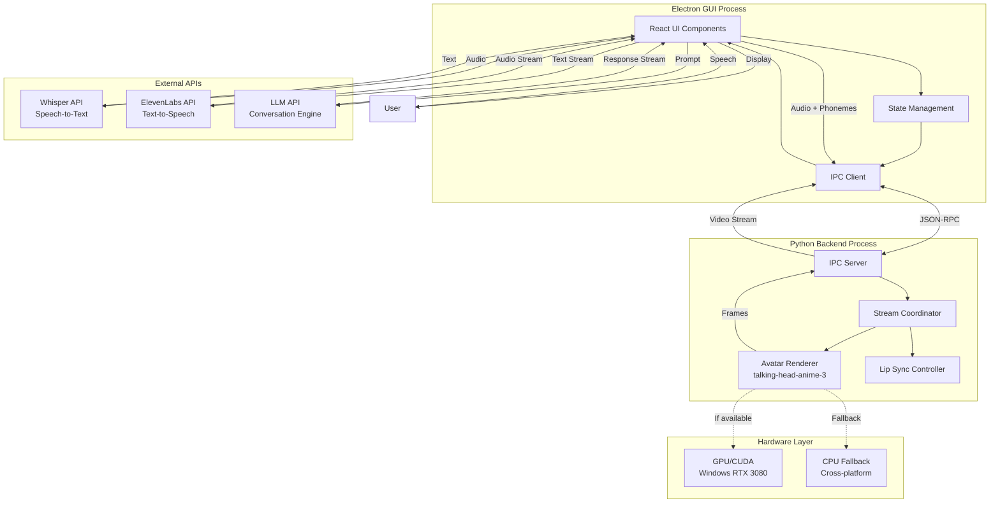

# Design Document: Persuasive Chatbot

## Overview

The persuasive chatbot system is a speech-to-speech debate application that combines real-time conversational AI with animated avatar rendering. The system enables users to engage in philosophical debates about machine intelligence versus human capacities, with the chatbot maintaining a consistent argumentative position (either post-human or humanist).

The architecture follows a multi-process design with three primary subsystems:

1. **Python Backend**: Handles avatar rendering using talking-head-anime-3, with GPU acceleration via CUDA on Windows
2. **Electron GUI**: Provides the cross-platform user interface built with React
3. **API Integration Layer**: Manages external services (Whisper STT, ElevenLabs TTS, LLM API)

Key design goals include:
- Sub-3-second response latency through streaming and parallel processing
- Smooth avatar animation at 30+ FPS with GPU acceleration
- Graceful degradation when GPU unavailable (24+ FPS CPU fallback)
- Professional, polished user experience with responsive feedback
- Cross-platform compatibility (macOS development, Windows production)

## Architecture

### System Architecture Diagram



### Architecture Principles

**Separation of Concerns**: The system separates rendering (Python), UI (Electron), and AI services (external APIs) into distinct processes that communicate via well-defined interfaces.

**Streaming-First Design**: All data flows support streaming to minimize latency:
- LLM responses stream token-by-token
- TTS converts text chunks as they arrive
- Avatar rendering processes audio segments in parallel

**Graceful Degradation**: Each component has fallback strategies:
- GPU unavailable → CPU rendering
- API failure → error display with retry
- Avatar rendering failure → audio-only mode

**Platform Abstraction**: Cross-platform compatibility through:
- Electron for GUI (native on both platforms)
- Python with platform-agnostic libraries
- Runtime hardware detection and configuration

### Inter-Process Communication Strategy

The system uses a **bidirectional JSON-RPC protocol** over standard input/output streams between Electron and Python processes.

**Communication Patterns**:

1. **Request-Response**: GUI requests avatar initialization, Python responds with status
2. **Streaming**: Python streams video frames to GUI during speech
3. **Event-Driven**: GUI sends audio/phoneme events, Python processes asynchronously

**Message Format**:
```json
{
  "jsonrpc": "2.0",
  "method": "render_speech",
  "params": {
    "audio_data": "base64_encoded_audio",
    "phonemes": [{"phoneme": "AH", "start": 0.0, "duration": 0.1}]
  },
  "id": 1
}
```

**Error Handling**: All IPC calls include timeout mechanisms (5s default) and error propagation to the GUI layer.

## Components and Interfaces

### 1. Avatar Renderer Component

**Responsibility**: Renders animated character face using talking-head-anime-3 model with GPU acceleration.

**Technology**: 
- Python with PyTorch
- talking-head-anime-3 pre-trained model
- CUDA 11.8+ for Windows GPU acceleration
- CPU fallback using PyTorch CPU backend

**Interface**:
```python
class AvatarRenderer:
    def initialize(self, use_gpu: bool = True) -> InitResult:
        """Initialize renderer with GPU or CPU backend"""
        
    def render_frame(self, phoneme: str, intensity: float) -> np.ndarray:
        """Render single frame for given phoneme"""
        
    def render_sequence(self, phonemes: List[Phoneme]) -> Iterator[np.ndarray]:
        """Stream frames for phoneme sequence"""
        
    def get_fps(self) -> float:
        """Return current rendering frame rate"""
        
    def shutdown(self) -> None:
        """Clean up resources"""
```

**GPU Acceleration Strategy**:
- Detect CUDA availability at startup using `torch.cuda.is_available()`
- Load model to GPU with `.to('cuda')` if available
- Batch frame rendering when possible (process multiple phonemes together)
- Monitor VRAM usage to prevent OOM (target: <6GB of 8GB available)
- Fall back to CPU if GPU initialization fails

**Performance Targets**:
- GPU mode: 30+ FPS, <100ms per frame
- CPU mode: 24+ FPS, <42ms per frame

### 2. Speech Input Processor Component

**Responsibility**: Convert user speech to text using Whisper API.

**Technology**: OpenAI Whisper API (cloud-based)

**Interface**:
```typescript
interface SpeechInputProcessor {
  startListening(): Promise<void>;
  stopListening(): Promise<string>;
  getTranscript(): Promise<TranscriptResult>;
  getConfidenceScore(): number;
}

interface TranscriptResult {
  text: string;
  confidence: number;
  language: string;
  duration: number;
}
```

**Implementation Strategy**:
- Use browser MediaRecorder API to capture audio
- Send audio chunks to Whisper API in WebM or WAV format
- Target 1-2 second transcription latency
- Implement confidence threshold (0.9) for clarification requests
- Handle background noise with pre-processing (noise gate)

### 3. Speech Output Generator Component

**Responsibility**: Convert chatbot text responses to natural speech using ElevenLabs API.

**Technology**: ElevenLabs Text-to-Speech API with streaming support

**Interface**:
```typescript
interface SpeechOutputGenerator {
  synthesize(text: string): Promise<AudioStream>;
  synthesizeStreaming(textStream: AsyncIterator<string>): AsyncIterator<AudioChunk>;
  getPhonemes(text: string): Promise<Phoneme[]>;
  setVoice(voiceId: string): void;
}

interface AudioChunk {
  audio: ArrayBuffer;
  phonemes: Phoneme[];
  timestamp: number;
}

interface Phoneme {
  phoneme: string;
  start: number;
  duration: number;
}
```

**Streaming Strategy**:
- Accept text chunks from LLM as they arrive
- Send to ElevenLabs streaming endpoint
- Receive audio + phoneme data in chunks
- Forward immediately to Avatar Renderer
- Target: first audio chunk within 500ms of first text chunk

### 4. Conversation Engine Component

**Responsibility**: Generate persuasive argumentative responses using LLM API.

**Technology**: LLM API (OpenAI GPT-4 or similar) with streaming support

**Interface**:
```typescript
interface ConversationEngine {
  initialize(position: 'post-human' | 'humanist'): void;
  generateResponse(userInput: string, context: Message[]): AsyncIterator<string>;
  getPosition(): string;
  resetSession(): void;
}

interface Message {
  role: 'user' | 'assistant' | 'system';
  content: string;
  timestamp: number;
}
```

**Prompt Engineering Strategy**:
- System prompt defines philosophical position and debate style
- Include conversation history (last 10 exchanges) for context
- Instruct model to use rhetorical strategies (evidence, examples, acknowledgment)
- Constrain response length (100-200 words) for natural pacing
- Include examples of position-consistent arguments in few-shot prompts

**Position Definitions**:
- **Post-human**: Argues machines will surpass human capacities, emphasizes AI progress, automation, and computational advantages
- **Humanist**: Argues humans remain necessary, emphasizes creativity, consciousness, ethics, and irreplaceable human qualities

### 5. Lip Sync Controller Component

**Responsibility**: Synchronize avatar mouth movements with speech audio using phoneme timing.

**Technology**: Python component that maps phonemes to mouth shapes

**Interface**:
```python
class LipSyncController:
    def map_phoneme_to_viseme(self, phoneme: str) -> str:
        """Map speech phoneme to visual mouth shape"""
        
    def generate_animation_sequence(self, phonemes: List[Phoneme], 
                                   fps: int) -> List[Viseme]:
        """Convert phoneme timeline to frame-by-frame visemes"""
        
    def interpolate_transitions(self, visemes: List[Viseme]) -> List[Viseme]:
        """Smooth transitions between mouth shapes"""
```

**Phoneme-to-Viseme Mapping**:
- Use standard viseme set: A, B, C, D, E, F, G, H, X (rest)
- Map IPA phonemes from ElevenLabs to visemes
- Example: /p/, /b/, /m/ → viseme B (lips closed)
- Interpolate between visemes for smooth transitions
- Maintain 100ms synchronization tolerance

### 6. GUI Component

**Responsibility**: Provide cross-platform user interface integrating all system components.

**Technology**: 
- React 18 for UI components
- Electron for desktop packaging
- Tailwind CSS for styling
- Framer Motion for animations
- Zustand for state management

**Component Structure**:
```
src/
├── components/
│   ├── AvatarDisplay.tsx       # Video stream display
│   ├── MicrophoneButton.tsx    # Recording control
│   ├── StatusIndicator.tsx     # System state display
│   ├── TranscriptPanel.tsx     # Optional text display
│   ├── ErrorBoundary.tsx       # Error handling
│   └── LoadingState.tsx        # Progress indicators
├── hooks/
│   ├── useAudioRecording.ts    # Microphone capture
│   ├── useAvatarStream.ts      # Python IPC connection
│   ├── useConversation.ts      # LLM interaction
│   └── useSpeechSynthesis.ts   # TTS integration
├── services/
│   ├── ipcService.ts           # Python backend communication
│   ├── whisperService.ts       # Speech-to-text API
│   ├── elevenLabsService.ts    # Text-to-speech API
│   └── llmService.ts           # Conversation API
└── store/
    └── conversationStore.ts    # Global state management
```

**State Management**:
```typescript
interface AppState {
  sessionStatus: 'idle' | 'listening' | 'processing' | 'speaking' | 'error';
  position: 'post-human' | 'humanist';
  conversationHistory: Message[];
  currentTranscript: string;
  errorMessage: string | null;
  hardwareCapabilities: HardwareInfo;
}
```

**Visual Design Principles**:
- Clean, minimal interface focusing attention on avatar
- Dark theme to reduce eye strain during extended sessions
- Smooth state transitions (300ms) using Framer Motion
- Microphone button with pulsing animation during listening
- Status indicators using color coding (blue=listening, yellow=processing, green=speaking)
- Professional typography (Inter font family)
- Responsive feedback within 100ms for all interactions

### 7. Stream Coordinator Component

**Responsibility**: Orchestrate parallel processing of audio playback and avatar rendering.

**Technology**: Python asyncio for concurrent task management

**Interface**:
```python
class StreamCoordinator:
    async def process_speech_stream(self, audio_stream: AsyncIterator[AudioChunk]) -> None:
        """Coordinate parallel audio playback and avatar rendering"""
        
    async def play_audio(self, audio_chunk: AudioChunk) -> None:
        """Play audio chunk through system audio"""
        
    async def render_avatar(self, phonemes: List[Phoneme]) -> AsyncIterator[np.ndarray]:
        """Generate avatar frames for phonemes"""
        
    def synchronize(self, audio_timestamp: float, frame_timestamp: float) -> None:
        """Maintain A/V sync within tolerance"""
```

**Parallel Processing Strategy**:
- Use asyncio.gather() to run audio playback and rendering concurrently
- Audio playback has priority (real-time constraint)
- Avatar rendering runs in parallel, drops frames if falling behind
- Monitor synchronization drift, adjust frame timing if >100ms offset
- Buffer 2-3 frames ahead to smooth rendering jitter

## Data Models

### Message Model
```typescript
interface Message {
  id: string;
  role: 'user' | 'assistant' | 'system';
  content: string;
  timestamp: number;
  audioUrl?: string;  // Optional reference to audio file
}
```

### Phoneme Model
```typescript
interface Phoneme {
  phoneme: string;      // IPA phoneme symbol
  start: number;        // Start time in seconds
  duration: number;     // Duration in seconds
  viseme?: string;      // Mapped visual mouth shape
}
```

### Avatar Frame Model
```python
@dataclass
class AvatarFrame:
    frame_data: np.ndarray  # RGB image array (H, W, 3)
    timestamp: float        # Frame timestamp in seconds
    frame_number: int       # Sequential frame index
    fps: float             # Current rendering FPS
```

### Hardware Capabilities Model
```typescript
interface HardwareInfo {
  platform: 'windows' | 'macos';
  gpuAvailable: boolean;
  gpuName?: string;
  vramMB?: number;
  cudaVersion?: string;
  renderingMode: 'gpu' | 'cpu';
  targetFPS: number;
}
```

### Session State Model
```typescript
interface DebateSession {
  sessionId: string;
  position: 'post-human' | 'humanist';
  startTime: number;
  messages: Message[];
  status: SessionStatus;
  metrics: SessionMetrics;
}

interface SessionMetrics {
  totalExchanges: number;
  averageResponseTime: number;
  averageFPS: number;
  apiErrors: number;
}

type SessionStatus = 
  | 'initializing'
  | 'ready'
  | 'listening'
  | 'processing'
  | 'speaking'
  | 'paused'
  | 'error'
  | 'ended';
```

### Error Model
```typescript
interface SystemError {
  code: string;
  message: string;
  component: 'avatar' | 'stt' | 'tts' | 'llm' | 'ipc' | 'gui';
  severity: 'warning' | 'error' | 'critical';
  timestamp: number;
  recoverable: boolean;
  retryable: boolean;
}
```

### IPC Message Model
```typescript
interface IPCMessage {
  jsonrpc: '2.0';
  method: string;
  params?: Record<string, any>;
  id?: number | string;
  result?: any;
  error?: {
    code: number;
    message: string;
    data?: any;
  };
}
```

### Configuration Model
```typescript
interface SystemConfig {
  avatar: {
    modelPath: string;
    useGPU: boolean;
    targetFPS: number;
    fallbackFPS: number;
  };
  apis: {
    whisper: {
      apiKey: string;
      model: string;
    };
    elevenLabs: {
      apiKey: string;
      voiceId: string;
      model: string;
    };
    llm: {
      apiKey: string;
      model: string;
      maxTokens: number;
      temperature: number;
    };
  };
  debate: {
    position: 'post-human' | 'humanist';
    maxSessionDuration: number;
    contextWindowSize: number;
  };
  performance: {
    maxResponseTime: number;
    syncTolerance: number;
    audioBufferSize: number;
  };
}
```


## Correctness Properties

*A property is a characteristic or behavior that should hold true across all valid executions of a system—essentially, a formal statement about what the system should do. Properties serve as the bridge between human-readable specifications and machine-verifiable correctness guarantees.*

### Property 1: Text-to-Speech Conversion Completeness

*For any* generated text response from the Conversation Engine, the Speech Output Generator should produce corresponding audio output.

**Validates: Requirements 1.3**

### Property 2: Conversational Context Preservation

*For any* sequence of user inputs within a Debate Session, later responses from the Conversation Engine should reference or build upon earlier exchanges in the conversation history.

**Validates: Requirements 1.4**

### Property 3: Audio-Visual Synchronization

*For any* generated speech audio with phoneme timing data, the Lip Sync Controller should produce avatar mouth movements that align with the audio within 100ms tolerance throughout the entire speech segment.

**Validates: Requirements 2.2, 7.4, 8.1, 8.2**

### Property 4: Frame Rate Performance Thresholds

*For any* avatar rendering session, the Avatar Renderer should maintain minimum 24 FPS in CPU mode and minimum 30 FPS in GPU mode during active speech animation.

**Validates: Requirements 2.4, 2.7, 11.2, 11.3**

### Property 5: Initialization Time Constraint

*For any* system startup sequence, all components (Avatar Renderer, IPC server, GUI) should complete initialization within 10 seconds, with Avatar Renderer specifically loading within 3 seconds.

**Validates: Requirements 2.5, 11.6**

### Property 6: Philosophical Position Consistency

*For any* user input during a Debate Session, the Conversation Engine should generate responses that support its assigned position (post-human or humanist) without contradicting that position, and should include philosophical concepts relevant to that position.

**Validates: Requirements 3.2, 3.4, 3.5**

### Property 7: Counterargument Defense

*For any* user input that presents a counterargument to the chatbot's position, the Conversation Engine should generate a response that defends its position with relevant examples or evidence.

**Validates: Requirements 3.3**

### Property 8: Rhetorical Strategy Employment

*For any* generated response, the Conversation Engine should employ at least one rhetorical strategy (evidence, examples, or logical reasoning) and should cite relevant domains (art, science, government) when supporting its position.

**Validates: Requirements 4.1, 4.3, 4.4**

### Property 9: Argument Acknowledgment

*For any* user input that presents an argument, the Conversation Engine should generate a response that acknowledges the user's argument before presenting counterarguments.

**Validates: Requirements 4.2**

### Property 10: Respectful Tone Maintenance

*For any* generated response, the Conversation Engine should maintain respectful language and tone even when presenting opposing views.

**Validates: Requirements 4.5**

### Property 11: State Transition Animations

*For any* GUI state change (idle → listening → processing → speaking), the interface should display smooth transitions with appropriate visual indicators.

**Validates: Requirements 5.7**

### Property 12: Processing Feedback Display

*For any* background processing operation (transcription, generation, synthesis), the GUI should display loading states or progress indicators.

**Validates: Requirements 5.8**

### Property 13: UI Responsiveness

*For any* user interaction (button click, state change), the GUI should provide visual feedback within 100ms and remain responsive during background operations.

**Validates: Requirements 5.9, 11.4, 13.4**

### Property 14: Transcription Accuracy

*For any* clear speech audio input (without significant background noise), the Speech Input Processor should achieve minimum 90% transcription accuracy when compared to ground truth text.

**Validates: Requirements 6.2**

### Property 15: Natural Speech Pattern Handling

*For any* speech input containing natural patterns (pauses, filler words like "um" or "uh"), the Speech Input Processor should successfully transcribe the meaningful content.

**Validates: Requirements 6.5**

### Property 16: Voice Consistency

*For any* sequence of text-to-speech conversions within a Debate Session, the Speech Output Generator should maintain consistent voice characteristics (pitch, tone, speaking rate) across all outputs.

**Validates: Requirements 7.3**

### Property 17: Audio Quality Standard

*For any* generated speech audio, the Speech Output Generator should produce audio at minimum 22kHz sample rate.

**Validates: Requirements 7.5**

### Property 18: Phoneme-to-Viseme Mapping

*For any* speech phoneme from the IPA phoneme set, the Lip Sync Controller should map it to an appropriate viseme (mouth shape) from the standard viseme set.

**Validates: Requirements 8.3**

### Property 19: Pause Handling in Lip Sync

*For any* speech audio segment containing pauses (silence periods), the Lip Sync Controller should render closed or neutral mouth positions during those pauses.

**Validates: Requirements 8.4**

### Property 20: Lip Sync Round-Trip Consistency

*For any* generated speech audio with phoneme data, rendering the animation sequence multiple times should produce consistent lip movements (same audio input → same animation output).

**Validates: Requirements 8.5**

### Property 21: Error Logging Completeness

*For any* error that occurs in any system component, the error should be logged with a timestamp and component identifier.

**Validates: Requirements 10.3**

### Property 22: End-to-End Response Time

*For any* user speech input, the total time from input completion to speech output start (transcription + generation + synthesis) should target 2-3 seconds, with maximum acceptable latency of 5 seconds.

**Validates: Requirements 1.1, 1.2, 11.1**

### Property 23: Extended Session Stability

*For any* Debate Session running continuously for 30 minutes, the system should maintain stable performance without memory leaks, degraded FPS, or increased latency.

**Validates: Requirements 11.5**

### Property 24: Streaming Text-to-Speech

*For any* LLM response being generated token-by-token, the Speech Output Generator should begin text-to-speech conversion before the complete response is generated (streaming behavior).

**Validates: Requirements 11.7**

### Property 25: Parallel Audio-Visual Processing

*For any* speech output being generated, audio playback and avatar animation rendering should execute in parallel without blocking each other.

**Validates: Requirements 11.8**

### Property 26: Consciousness Claim Prohibition

*For any* generated response from the Conversation Engine, the text should not contain claims of genuine beliefs, consciousness, sentience, or subjective experience.

**Validates: Requirements 12.4**

### Property 27: Loading State Display

*For any* processing operation that takes longer than 200ms, the GUI should display a loading state or progress indicator.

**Validates: Requirements 13.5**

### Property 28: Cross-Platform Path Handling

*For any* file system operation in the Python backend, the system should use platform-agnostic path handling (e.g., pathlib or os.path) that works correctly on both Windows and macOS without hardcoded separators.

**Validates: Requirements 14.2, 14.8**

### Property 29: Hardware Capability Detection

*For any* system startup, the chatbot should detect available hardware capabilities (GPU presence, CUDA availability, VRAM) and configure the rendering mode (GPU or CPU) accordingly.

**Validates: Requirements 14.5**


## Error Handling

### Error Categories and Strategies

#### 1. API Failures (Whisper, ElevenLabs, LLM)

**Error Types**:
- Network timeout (>30s)
- Rate limiting (429 status)
- Authentication failure (401/403)
- Service unavailable (503)
- Invalid response format

**Handling Strategy**:
- Display user-friendly error message in GUI
- Provide "Retry" button for transient failures
- Implement exponential backoff for rate limits (1s, 2s, 4s, 8s)
- Log full error details for debugging
- Maintain conversation state to resume after recovery
- For LLM failures: offer to continue with last successful state
- For TTS failures: display text response as fallback
- For STT failures: prompt user to repeat input

**Implementation**:
```typescript
async function callAPIWithRetry<T>(
  apiCall: () => Promise<T>,
  maxRetries: number = 3
): Promise<T> {
  for (let attempt = 0; attempt < maxRetries; attempt++) {
    try {
      return await apiCall();
    } catch (error) {
      if (attempt === maxRetries - 1) throw error;
      if (isRetryable(error)) {
        await delay(Math.pow(2, attempt) * 1000);
        continue;
      }
      throw error;
    }
  }
}
```

#### 2. Avatar Rendering Failures

**Error Types**:
- Model loading failure (corrupted file, insufficient memory)
- GPU out of memory (VRAM exhausted)
- CUDA initialization failure
- Frame rendering timeout (>100ms per frame)
- IPC communication failure

**Handling Strategy**:
- Attempt GPU initialization, fall back to CPU on failure
- If CPU rendering also fails, switch to audio-only mode
- Display visual indicator when in degraded mode
- Monitor VRAM usage, reduce batch size if approaching limit
- Log rendering performance metrics for debugging
- Gracefully handle IPC disconnection with reconnection attempts

**Fallback Hierarchy**:
1. GPU rendering (30+ FPS target)
2. CPU rendering (24+ FPS target)
3. Audio-only mode (no avatar)

**Implementation**:
```python
class AvatarRenderer:
    def initialize(self):
        try:
            if torch.cuda.is_available():
                self.device = 'cuda'
                self.model.to('cuda')
                logger.info("GPU rendering enabled")
            else:
                raise RuntimeError("GPU not available")
        except Exception as e:
            logger.warning(f"GPU init failed: {e}, falling back to CPU")
            self.device = 'cpu'
            self.model.to('cpu')
            
    def render_frame(self, phoneme):
        try:
            return self._render_on_device(phoneme)
        except RuntimeError as e:
            if "out of memory" in str(e):
                torch.cuda.empty_cache()
                return self._render_on_cpu(phoneme)
            raise
```

#### 3. Network Connectivity Loss

**Error Types**:
- Complete network disconnection
- Intermittent connectivity
- DNS resolution failure

**Handling Strategy**:
- Detect network status using periodic health checks
- Pause Debate Session when network lost
- Display clear notification: "Network connection lost. Reconnecting..."
- Attempt automatic reconnection every 5 seconds
- Resume session when connectivity restored
- Preserve conversation state during disconnection

**Implementation**:
```typescript
class NetworkMonitor {
  private checkInterval: NodeJS.Timer;
  
  startMonitoring() {
    this.checkInterval = setInterval(async () => {
      const isOnline = await this.checkConnectivity();
      if (!isOnline && this.wasOnline) {
        this.handleDisconnection();
      } else if (isOnline && !this.wasOnline) {
        this.handleReconnection();
      }
      this.wasOnline = isOnline;
    }, 5000);
  }
  
  private async checkConnectivity(): Promise<boolean> {
    try {
      await fetch('https://api.openai.com/health', { method: 'HEAD' });
      return true;
    } catch {
      return false;
    }
  }
}
```

#### 4. IPC Communication Failures

**Error Types**:
- Python process crash
- Message serialization error
- Timeout waiting for response
- Broken pipe / disconnection

**Handling Strategy**:
- Implement message timeout (5s default)
- Validate message format before sending
- Attempt to restart Python process on crash
- Queue messages during reconnection
- Display error state in GUI if restart fails
- Preserve user's conversation history

**Implementation**:
```typescript
class IPCService {
  async sendMessage(method: string, params: any): Promise<any> {
    const messageId = this.generateId();
    const timeout = 5000;
    
    return new Promise((resolve, reject) => {
      const timer = setTimeout(() => {
        reject(new Error(`IPC timeout: ${method}`));
      }, timeout);
      
      this.pendingRequests.set(messageId, { resolve, reject, timer });
      
      try {
        this.pythonProcess.stdin.write(
          JSON.stringify({ jsonrpc: '2.0', method, params, id: messageId }) + '\n'
        );
      } catch (error) {
        clearTimeout(timer);
        this.pendingRequests.delete(messageId);
        this.handleProcessCrash();
        reject(error);
      }
    });
  }
  
  private async handleProcessCrash() {
    logger.error("Python process crashed, attempting restart");
    try {
      await this.restartPythonProcess();
      this.emit('reconnected');
    } catch (error) {
      this.emit('fatal-error', error);
    }
  }
}
```

#### 5. Resource Exhaustion

**Error Types**:
- Memory leak (heap exhaustion)
- Disk space full (logging, temp files)
- CPU overload (>90% sustained)
- VRAM exhaustion

**Handling Strategy**:
- Monitor memory usage, warn at 80% threshold
- Implement automatic garbage collection triggers
- Rotate log files, limit total log size (100MB max)
- Clean up temporary audio files after use
- Reduce rendering quality if CPU overloaded
- Clear CUDA cache periodically

**Implementation**:
```python
class ResourceMonitor:
    def check_resources(self):
        memory_percent = psutil.virtual_memory().percent
        if memory_percent > 80:
            logger.warning(f"High memory usage: {memory_percent}%")
            gc.collect()
            if torch.cuda.is_available():
                torch.cuda.empty_cache()
                
        disk_percent = psutil.disk_usage('/').percent
        if disk_percent > 90:
            logger.warning(f"Low disk space: {disk_percent}%")
            self.cleanup_temp_files()
```

### Error Reporting and Logging

**Log Levels**:
- DEBUG: Detailed diagnostic information
- INFO: General system events (session start, API calls)
- WARNING: Recoverable issues (fallback activated, retry attempt)
- ERROR: Component failures requiring user attention
- CRITICAL: System-wide failures requiring restart

**Log Format**:
```
[2024-01-15 14:32:45.123] [ERROR] [AvatarRenderer] GPU initialization failed: CUDA not available
[2024-01-15 14:32:45.124] [INFO] [AvatarRenderer] Falling back to CPU rendering
```

**Log Destinations**:
- Console output (development)
- Rotating file logs (production): `logs/chatbot-YYYY-MM-DD.log`
- Error aggregation service (optional): Sentry or similar

**User-Facing Error Messages**:
- Avoid technical jargon
- Explain impact: "The avatar cannot be displayed, but audio will continue"
- Provide action: "Click Retry to attempt reconnection"
- Include support reference: "Error code: API_TIMEOUT_001"

## Testing Strategy

### Dual Testing Approach

The testing strategy employs both unit testing and property-based testing as complementary approaches:

- **Unit tests**: Verify specific examples, edge cases, error conditions, and integration points
- **Property tests**: Verify universal properties across randomized inputs for comprehensive coverage

Both testing approaches are necessary. Unit tests catch concrete bugs and validate specific scenarios, while property tests verify general correctness across a wide input space.

### Property-Based Testing

**Library Selection**:
- **Python components**: Use `hypothesis` library for property-based testing
- **TypeScript/JavaScript components**: Use `fast-check` library for property-based testing

**Configuration**:
- Minimum 100 iterations per property test (due to randomization)
- Each property test must reference its design document property
- Tag format: `# Feature: persuasive-chatbot, Property {number}: {property_text}`

**Example Property Test (Python)**:
```python
from hypothesis import given, strategies as st
import hypothesis

@given(st.text(min_size=1, max_size=500))
@hypothesis.settings(max_examples=100)
def test_property_1_text_to_speech_conversion(text: str):
    """
    Feature: persuasive-chatbot, Property 1: Text-to-Speech Conversion Completeness
    For any generated text response, Speech Output Generator should produce audio output.
    """
    generator = SpeechOutputGenerator()
    audio_output = generator.synthesize(text)
    
    assert audio_output is not None
    assert len(audio_output) > 0
    assert audio_output.sample_rate >= 22000
```

**Example Property Test (TypeScript)**:
```typescript
import fc from 'fast-check';

describe('Property 2: Conversational Context Preservation', () => {
  it('should reference earlier exchanges in later responses', () => {
    // Feature: persuasive-chatbot, Property 2: Conversational Context Preservation
    fc.assert(
      fc.property(
        fc.array(fc.string({ minLength: 10, maxLength: 200 }), { minLength: 2, maxLength: 10 }),
        async (userInputs) => {
          const engine = new ConversationEngine('post-human');
          const responses: string[] = [];
          
          for (const input of userInputs) {
            const response = await engine.generateResponse(input, responses);
            responses.push(response);
          }
          
          // Later responses should reference earlier context
          const lastResponse = responses[responses.length - 1].toLowerCase();
          const hasContextReference = userInputs.slice(0, -1).some(input =>
            lastResponse.includes(input.toLowerCase().split(' ')[0])
          );
          
          expect(hasContextReference || responses.length < 3).toBe(true);
        }
      ),
      { numRuns: 100 }
    );
  });
});
```

### Unit Testing Strategy

**Test Organization**:
```
tests/
├── unit/
│   ├── avatar/
│   │   ├── test_renderer_initialization.py
│   │   ├── test_gpu_fallback.py
│   │   └── test_frame_generation.py
│   ├── speech/
│   │   ├── test_whisper_integration.ts
│   │   ├── test_elevenlabs_integration.ts
│   │   └── test_lip_sync_mapping.py
│   ├── conversation/
│   │   ├── test_position_consistency.ts
│   │   └── test_prompt_engineering.ts
│   └── gui/
│       ├── test_state_management.ts
│       ├── test_error_display.ts
│       └── test_ipc_communication.ts
├── integration/
│   ├── test_end_to_end_flow.ts
│   ├── test_streaming_pipeline.ts
│   └── test_cross_platform.ts
└── property/
    ├── test_properties_avatar.py
    ├── test_properties_speech.ts
    └── test_properties_conversation.ts
```

**Unit Test Focus Areas**:

1. **Specific Examples**:
   - Avatar displays neutral expression when idle (Req 2.3)
   - GUI displays AI disclaimer at session start (Req 12.1)
   - Report includes all required sections (Req 9.2)

2. **Edge Cases**:
   - Background noise prevents transcription → retry prompt (Req 1.5)
   - Low transcription confidence → clarification request (Req 6.3)
   - GPU unavailable → CPU fallback (Req 2.8)
   - API failure → error display with retry (Req 10.1)
   - Avatar rendering error → audio-only mode (Req 10.2)
   - Network loss → pause and notify (Req 10.4)

3. **Integration Points**:
   - IPC message serialization/deserialization
   - Audio stream synchronization with video frames
   - State transitions in GUI (idle → listening → processing → speaking)
   - Error propagation from Python to Electron

4. **Platform-Specific Behavior**:
   - Windows: CUDA initialization and GPU rendering
   - macOS: CPU rendering performance
   - Both: File path handling, executable building

**Example Unit Test**:
```typescript
describe('Error Handling', () => {
  it('should display error and allow retry when API fails', async () => {
    // Validates Requirement 10.1
    const mockAPI = jest.fn().mockRejectedValue(new Error('Network timeout'));
    const { getByText, getByRole } = render(<ChatInterface apiCall={mockAPI} />);
    
    await userEvent.click(getByRole('button', { name: 'Start' }));
    
    await waitFor(() => {
      expect(getByText(/network timeout/i)).toBeInTheDocument();
      expect(getByRole('button', { name: 'Retry' })).toBeInTheDocument();
    });
    
    mockAPI.mockResolvedValueOnce({ success: true });
    await userEvent.click(getByRole('button', { name: 'Retry' }));
    
    await waitFor(() => {
      expect(getByText(/network timeout/i)).not.toBeInTheDocument();
    });
  });
});
```

### Performance Testing

**Metrics to Measure**:
- End-to-end response latency (target: 2-3s, max: 5s)
- Avatar rendering FPS (GPU: 30+, CPU: 24+)
- Initialization time (target: <10s)
- Memory usage over 30-minute session
- VRAM usage during GPU rendering
- UI responsiveness (target: <100ms feedback)

**Performance Test Approach**:
```python
def test_response_time_performance():
    """Validates Requirements 1.1, 1.2, 11.1"""
    chatbot = Chatbot()
    test_inputs = load_test_audio_samples()
    
    latencies = []
    for audio in test_inputs:
        start = time.time()
        response = chatbot.process_speech(audio)
        latency = time.time() - start
        latencies.append(latency)
    
    avg_latency = sum(latencies) / len(latencies)
    assert avg_latency <= 3.0, f"Average latency {avg_latency}s exceeds 3s target"
    assert max(latencies) <= 5.0, f"Max latency {max(latencies)}s exceeds 5s limit"
```

### Cross-Platform Testing

**Test Matrix**:
- Windows 10 with RTX 3080 (GPU mode)
- Windows 11 without GPU (CPU mode)
- macOS Monterey (CPU mode)
- macOS Ventura (CPU mode)

**Automated CI/CD Testing**:
- GitHub Actions for macOS builds and tests
- Windows VM for Windows builds and tests
- Run unit tests on both platforms
- Run property tests with reduced iterations (50) in CI
- Build executables for both platforms
- Smoke test: launch app and verify initialization

### Manual Testing Checklist

**Functional Testing**:
- [ ] Complete debate session (5+ exchanges)
- [ ] Avatar lip sync quality assessment
- [ ] Voice quality and naturalness
- [ ] Argument coherence and position consistency
- [ ] Error recovery (simulate API failure)
- [ ] GPU fallback (disable CUDA)
- [ ] Audio-only mode (simulate rendering failure)
- [ ] Network disconnection recovery
- [ ] Extended session (30 minutes)

**UI/UX Testing**:
- [ ] Visual design quality and professionalism
- [ ] Animation smoothness
- [ ] Loading state clarity
- [ ] Error message helpfulness
- [ ] Responsive feedback timing
- [ ] Transcript display (if enabled)
- [ ] Cross-platform UI consistency

**Performance Testing**:
- [ ] Response time measurement (10 exchanges)
- [ ] FPS measurement (GPU and CPU modes)
- [ ] Memory usage monitoring (30-minute session)
- [ ] Initialization time measurement
- [ ] UI responsiveness during processing

### Test Coverage Goals

- **Unit test coverage**: 80%+ for critical paths
- **Property test coverage**: All 29 properties implemented
- **Integration test coverage**: All major user flows
- **Platform coverage**: Both Windows and macOS
- **Error scenario coverage**: All identified error types

### Continuous Integration

**CI Pipeline**:
1. Lint and format check (ESLint, Black, Prettier)
2. Type checking (TypeScript, mypy)
3. Unit tests (Jest, pytest)
4. Property tests (fast-check, hypothesis) - 50 iterations in CI
5. Integration tests
6. Build executables (Windows, macOS)
7. Smoke tests on built executables

**Pre-commit Hooks**:
- Format code (Prettier, Black)
- Lint code (ESLint, pylint)
- Run fast unit tests (<5s)
- Type checking

