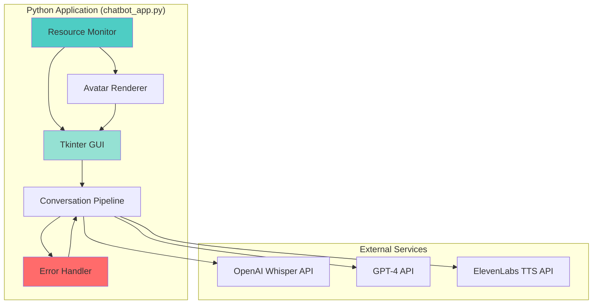

# Design Document: Chatbot Production Enhancements

## Overview

This design document specifies the technical architecture for transforming the persuasive chatbot MVP into a production-ready, presentation-worthy system. The enhancements focus on five key areas:

1. **Robust Error Handling**: API retry mechanisms, user-friendly error messages, network monitoring, and crash recovery
2. **Performance Monitoring**: Memory/VRAM tracking, session stability, and automatic garbage collection
3. **Ethical Transparency**: Disclaimers, position disclosure, and technology information
4. **Full HD UI Redesign**: 1920x1080 optimization with modern, professional design
5. **System Cleanup**: Removal of old web-based architecture remnants

### Current Architecture Context

The system is a **standalone Python application** launched via `START_CHATBOT.bat`. It consists of:

- **Python Backend** (`backend/src/chatbot_app.py`): Single-file tkinter GUI application
- **Avatar Rendering**: talking-head-anime-3 with GPU acceleration (CUDA) or CPU fallback
- **API Integration**: OpenAI Whisper (STT), GPT-4 (LLM), ElevenLabs (TTS)
- **No Web UI**: The old Electron/React frontend is deprecated and should be removed

The application runs entirely in Python with a native tkinter window displaying the avatar, microphone controls, and conversation transcript.

### Design Goals

- Maintain sub-3-second response latency
- Support 30+ minute sessions without degradation
- Provide clear, actionable error messages
- Achieve professional presentation quality
- Ensure ethical transparency about AI capabilities
- Optimize for Full HD displays (1920x1080)

## Architecture

### High-Level Component Diagram



### Component Responsibilities

#### Error Handler
- Implements exponential backoff retry logic for API calls
- Translates technical errors into user-friendly messages
- Monitors network connectivity
- Handles process crash detection and recovery
- Logs all errors with context

#### Resource Monitor
- Tracks memory usage (Python process)
- Monitors VRAM usage (GPU rendering)
- Triggers garbage collection when thresholds exceeded
- Validates session stability metrics
- Provides performance telemetry

#### Conversation Pipeline
- Orchestrates STT → LLM → TTS flow
- Manages conversation state
- Handles interruptions
- Coordinates with error handler for retries
- Maintains conversation history

#### Avatar Renderer
- Renders talking-head-anime-3 frames
- Synchronizes lip movements with phonemes
- Applies emotional expressions
- Manages GPU/CPU rendering modes
- Implements smooth transitions

#### Tkinter GUI
- Displays avatar, controls, and transcript
- Optimized for 1920x1080 resolution
- Modern design system with smooth animations
- Shows disclaimers and ethical transparency
- Provides status indicators and error messages

## Components and Interfaces

### 1. Error Handler Component

#### Class: `APIRetryHandler`

```python
class APIRetryHandler:
    """Handles API calls with exponential backoff retry logic."""
    
    def __init__(self, max_retries: int = 4, base_delay: float = 1.0):
        self.max_retries = max_retries
        self.base_delay = base_delay
        self.logger = logging.getLogger(__name__)
    
    async def call_with_retry(
        self,
        api_func: Callable,
        *args,
        **kwargs
    ) -> Any:
        """
        Execute API call with exponential backoff.
        
        Retry delays: 1s, 2s, 4s, 8s
        Returns: API response or raises RetryExhaustedError
        """
        pass
    
    def translate_error(self, error: Exception) -> str:
        """Convert technical error to user-friendly message."""
        pass
```

#### Class: `NetworkMonitor`

```python
class NetworkMonitor:
    """Monitors network connectivity status."""
    
    def __init__(self, check_interval: float = 10.0):
        self.check_interval = check_interval
        self.is_connected = True
        self.callbacks: List[Callable] = []
    
    def start_monitoring(self):
        """Start background connectivity checks."""
        pass
    
    def register_callback(self, callback: Callable[[bool], None]):
        """Register callback for connectivity changes."""
        pass
    
    def check_connectivity(self) -> bool:
        """Check if internet is available."""
        pass
```

#### Class: `ProcessMonitor`

```python
class ProcessMonitor:
    """Monitors Python process health."""
    
    def __init__(self):
        self.is_healthy = True
        self.last_heartbeat = time.time()
    
    def heartbeat(self):
        """Update heartbeat timestamp."""
        pass
    
    def check_health(self) -> bool:
        """Check if process is responsive."""
        pass
```

### 2. Resource Monitor Component

#### Class: `ResourceMonitor`

```python
class ResourceMonitor:
    """Monitors system resource usage."""
    
    def __init__(
        self,
        memory_warning_threshold: float = 0.8,
        memory_critical_threshold: float = 0.9,
        vram_warning_threshold: float = 5.0,  # GB
        vram_critical_threshold: float = 6.0,  # GB
        check_interval: float = 5.0
    ):
        self.memory_warning_threshold = memory_warning_threshold
        self.memory_critical_threshold = memory_critical_threshold
        self.vram_warning_threshold = vram_warning_threshold
        self.vram_critical_threshold = vram_critical_threshold
        self.check_interval = check_interval
        self.metrics: Dict[str, float] = {}
    
    def start_monitoring(self):
        """Start background resource monitoring."""
        pass
    
    def get_memory_usage(self) -> float:
        """Get current memory usage in GB."""
        pass
    
    def get_vram_usage(self) -> Optional[float]:
        """Get current VRAM usage in GB (if GPU available)."""
        pass
    
    def trigger_garbage_collection(self):
        """Force garbage collection and log results."""
        pass
    
    def check_session_stability(self, session_duration: float) -> bool:
        """Verify performance metrics for extended sessions."""
        pass
```

### 3. Enhanced Conversation Pipeline

#### Class: `EnhancedChatbotApp`

```python
class EnhancedChatbotApp(ChatbotApp):
    """Enhanced chatbot with production features."""
    
    def __init__(self):
        super().__init__()
        self.error_handler = APIRetryHandler()
        self.resource_monitor = ResourceMonitor()
        self.network_monitor = NetworkMonitor()
        self.session_start_time = None
        self.disclaimer_shown = False
    
    def _show_disclaimer(self):
        """Display ethical transparency disclaimer."""
        pass
    
    def _process_pipeline_with_retry(self):
        """Enhanced pipeline with error handling and retries."""
        pass
    
    def _handle_network_change(self, is_connected: bool):
        """Handle network connectivity changes."""
        pass
```

### 4. Full HD UI Components

#### Enhanced GUI Layout

```python
class FullHDGUI:
    """Full HD optimized GUI (1920x1080)."""
    
    # Layout dimensions for 1920x1080
    WINDOW_WIDTH = 1920
    WINDOW_HEIGHT = 1080
    AVATAR_SIZE = (512, 512)
    SIDEBAR_WIDTH = 400
    HEADER_HEIGHT = 80
    FOOTER_HEIGHT = 60
    
    def __init__(self, root: tk.Tk):
        self.root = root
        self._setup_window()
        self._apply_design_system()
    
    def _setup_window(self):
        """Configure window for Full HD."""
        pass
    
    def _apply_design_system(self):
        """Apply modern design system."""
        pass
    
    def _create_disclaimer_dialog(self) -> tk.Toplevel:
        """Create modal disclaimer dialog."""
        pass
    
    def _create_about_section(self) -> tk.Frame:
        """Create technology information section."""
        pass
```

## Data Models

### Error Context

```python
@dataclass
class ErrorContext:
    """Context information for error handling."""
    error_type: str  # "network", "api", "system"
    original_error: Exception
    timestamp: float
    retry_count: int
    user_message: str
    technical_details: str
    is_recoverable: bool
```

### Resource Metrics

```python
@dataclass
class ResourceMetrics:
    """System resource usage metrics."""
    timestamp: float
    memory_usage_gb: float
    memory_percent: float
    vram_usage_gb: Optional[float]
    vram_percent: Optional[float]
    session_duration: float
    frame_rate: float
    response_latency: float
```

### Session State

```python
@dataclass
class SessionState:
    """Current session state."""
    session_id: str
    start_time: float
    is_active: bool
    is_connected: bool
    disclaimer_accepted: bool
    conversation_turns: int
    total_errors: int
    recovered_errors: int
```

### Disclaimer Configuration

```python
@dataclass
class DisclaimerConfig:
    """Disclaimer display configuration."""
    title: str
    message: str
    position_disclosure: str
    technology_info: List[str]
    limitations: List[str]
    min_display_time: float  # seconds
    requires_acknowledgment: bool
```

## Correctness Properties

*A property is a characteristic or behavior that should hold true across all valid executions of a system—essentially, a formal statement about what the system should do. Properties serve as the bridge between human-readable specifications and machine-verifiable correctness guarantees.*


### Property Reflection

After analyzing all acceptance criteria, I identified several opportunities to consolidate redundant properties:

**Consolidations:**
1. Properties 1.1 and 1.2 both test retry behavior - combined into single comprehensive retry property
2. Properties 2.1 and 2.2 both test error message quality - combined into error message sanitization property
3. Properties 5.1 and 6.1 both test monitoring frequency - combined into resource monitoring frequency property
4. Properties 5.5 and 6.2 both test resource limits - kept separate as they test different resources (RAM vs VRAM)
5. Properties 7.2 and 7.5 both test performance invariants - combined into extended session performance property
6. Properties 9.1, 9.3, 9.4, 9.5 all test disclaimer behavior - combined into comprehensive disclaimer property
7. Properties 10.1 and 10.4 both test position display - combined into position visibility property
8. Properties 15.1, 15.3, 15.4 all test animation quality - combined into smooth animation property
9. Properties 16.3, 16.4, 16.5 all test UI consistency - combined into UI resilience property
10. Properties 17.1, 17.2, 17.4 all test conversational feel - combined into natural interaction property

This reduces the total from 85 potential properties to approximately 45 unique, non-redundant properties.

### Property 1: API Retry with Exponential Backoff

*For any* API call that fails, the system should retry with exponential backoff delays of 1s, 2s, 4s, 8s (maximum 4 retries), and preserve conversation state throughout all retry attempts.

**Validates: Requirements 1.1, 1.2, 1.4**

### Property 2: Retry Exhaustion Error Display

*For any* API call where all retries are exhausted, the system should display a user-friendly error message.

**Validates: Requirements 1.3**

### Property 3: Retry Logging Completeness

*For any* API retry attempt, the system should log the attempt with timestamp and error details.

**Validates: Requirements 1.5**

### Property 4: Error Message Sanitization

*For any* error that occurs, the displayed message should be human-readable, avoid technical stack traces or API codes, and provide actionable guidance.

**Validates: Requirements 2.1, 2.2, 2.3**

### Property 5: Recoverable Error UI

*For any* recoverable error, the UI should display a Retry button.

**Validates: Requirements 2.4**

### Property 6: Error Message Categorization

*For any* error, the system should display different messages for network errors, API errors, and system errors.

**Validates: Requirements 2.5**

### Property 7: Network Connectivity Monitoring Frequency

*For any* active session, network connectivity checks should occur every 10 seconds.

**Validates: Requirements 3.1**

### Property 8: Network Reconnection Round Trip

*For any* session, losing network connectivity then restoring it should resume the session automatically.

**Validates: Requirements 3.3**

### Property 9: Input Queuing During Outage

*For any* user inputs made during network outage, they should be queued and processed after reconnection.

**Validates: Requirements 3.4**

### Property 10: Crash Detection Timing

*For any* backend process crash, the system should detect it within 2 seconds.

**Validates: Requirements 4.1**

### Property 11: Crash Recovery Round Trip

*For any* backend crash, automatic restart should restore the session state.

**Validates: Requirements 4.2, 4.3**

### Property 12: Crash Logging Completeness

*For any* crash, the system should log crash details including stack trace and system state.

**Validates: Requirements 4.5**

### Property 13: Resource Monitoring Frequency

*For any* active session, memory and VRAM usage should be tracked every 5 seconds.

**Validates: Requirements 5.1, 6.1**

### Property 14: Resource Metrics Logging

*For any* resource monitoring check, current memory and VRAM usage should be displayed in developer console.

**Validates: Requirements 5.4, 6.5**

### Property 15: Memory Usage Limit

*For any* normal operation, memory usage should remain below 2GB.

**Validates: Requirements 5.5**

### Property 16: VRAM Usage Limit

*For any* GPU rendering session, VRAM usage should remain below 6GB.

**Validates: Requirements 6.2**

### Property 17: Extended Session Stability

*For any* session lasting 30 minutes or longer, the system should maintain stable operation without crashes or degradation.

**Validates: Requirements 7.1**


### Property 18: Extended Session Performance

*For any* session lasting 30 minutes or longer, frame rates should remain consistent and response latency should stay below 3 seconds.

**Validates: Requirements 7.2, 7.5**

### Property 19: Memory Leak Prevention

*For any* extended operation, memory usage should not continuously increase over time.

**Validates: Requirements 7.3**

### Property 20: Periodic Garbage Collection

*For any* active session, garbage collection should be triggered every 10 minutes.

**Validates: Requirements 8.1**

### Property 21: Temporary File Cleanup

*For any* audio playback completion, temporary audio files should be cleared.

**Validates: Requirements 8.3**

### Property 22: GPU Resource Release

*For any* switch from GPU to CPU rendering mode, GPU resources should be released.

**Validates: Requirements 8.4**

### Property 23: Garbage Collection Logging

*For any* garbage collection event, the system should log the event with memory freed amount.

**Validates: Requirements 8.5**

### Property 24: Disclaimer Display and Acknowledgment

*For any* new session, a disclaimer should be displayed for at least 3 seconds, require user acknowledgment before proceeding, and log acceptance with timestamp.

**Validates: Requirements 9.1, 9.3, 9.4, 9.5**

### Property 25: Position Visibility

*For any* session, the chatbot's philosophical position should be displayed at session start and remain visible in the header throughout.

**Validates: Requirements 10.1, 10.4**

### Property 26: Aspect Ratio Preservation

*For any* UI element at Full HD resolution, aspect ratios should be maintained without distortion.

**Validates: Requirements 12.4**

### Property 27: Resolution Scaling

*For any* display resolution larger than Full HD, the UI should scale gracefully and remain usable.

**Validates: Requirements 12.5**

### Property 28: Design System Consistency

*For any* UI element, it should use colors, typography, and spacing defined in the design system.

**Validates: Requirements 13.1**

### Property 29: Production Mode Debug Hiding

*For any* production mode execution, developer tools and debug information should be hidden.

**Validates: Requirements 13.4, 16.2**

### Property 30: Avatar Visibility Invariant

*For any* UI state, the avatar should remain visible and not be obscured by other elements.

**Validates: Requirements 14.4**

### Property 31: Avatar Status Indicator Visibility

*For any* avatar state (speaking, listening, thinking), status indicators should be clearly displayed.

**Validates: Requirements 14.5**

### Property 32: Avatar Frame Rate

*For any* avatar animation, expressions and mouth movements should be rendered at 30+ FPS.

**Validates: Requirements 14.2, 15.5**

### Property 33: Smooth Animation Transitions

*For any* state transition, the UI should implement smooth transitions with 300ms duration using easing functions, without visual stuttering.

**Validates: Requirements 15.1, 15.3, 15.4**

### Property 34: Visual Feedback Responsiveness

*For any* user action, visual feedback should be provided within 100ms.

**Validates: Requirements 15.2**

### Property 35: UI Resilience

*For any* error or state change, the UI should display loading states elegantly, handle errors without breaking visual presentation, and maintain visual consistency.

**Validates: Requirements 16.3, 16.4, 16.5**

### Property 36: Natural Interaction

*For any* conversation interaction, the system should minimize artificial delays, use conversational language, avoid robotic patterns, and provide natural feedback cues.

**Validates: Requirements 17.1, 17.2, 17.4, 17.3**

### Property 37: Conversation Interruption Support

*For any* ongoing bot speech, the user should be able to interrupt and start a new turn.

**Validates: Requirements 17.5**

## Error Handling

### Error Categories

The system handles three primary error categories:

1. **Network Errors**: Connection failures, timeouts, DNS resolution failures
2. **API Errors**: Authentication failures (401), rate limiting (429), service unavailable (503)
3. **System Errors**: Memory exhaustion, GPU failures, process crashes

### Error Handling Strategy

```python
class ErrorHandlingStrategy:
    """Defines error handling approach for each category."""
    
    NETWORK_ERRORS = {
        "retry": True,
        "max_retries": 4,
        "backoff": "exponential",
        "user_message": "Network connection issue. Retrying...",
        "fallback": "queue_for_later"
    }
    
    API_ERRORS = {
        "401": {
            "retry": False,
            "user_message": "API authentication failed. Please check your API keys.",
            "action": "show_settings"
        },
        "429": {
            "retry": True,
            "max_retries": 2,
            "backoff": "exponential",
            "user_message": "Rate limit reached. Waiting before retry...",
        },
        "503": {
            "retry": True,
            "max_retries": 3,
            "backoff": "exponential",
            "user_message": "Service temporarily unavailable. Retrying...",
        }
    }
    
    SYSTEM_ERRORS = {
        "memory_exhausted": {
            "retry": False,
            "user_message": "System memory low. Please close other applications.",
            "action": "trigger_gc"
        },
        "gpu_failure": {
            "retry": False,
            "user_message": "GPU rendering failed. Switching to CPU mode...",
            "action": "fallback_to_cpu"
        },
        "process_crash": {
            "retry": True,
            "max_retries": 3,
            "user_message": "System encountered an error. Attempting recovery...",
            "action": "restart_process"
        }
    }
```

### Retry Algorithm

```python
def exponential_backoff_retry(
    func: Callable,
    max_retries: int = 4,
    base_delay: float = 1.0
) -> Any:
    """
    Execute function with exponential backoff retry.
    
    Delays: 1s, 2s, 4s, 8s
    """
    for attempt in range(max_retries + 1):
        try:
            return func()
        except Exception as e:
            if attempt == max_retries:
                raise RetryExhaustedError(f"Failed after {max_retries} retries") from e
            
            delay = base_delay * (2 ** attempt)
            logger.warning(f"Attempt {attempt + 1} failed: {e}. Retrying in {delay}s...")
            time.sleep(delay)
```

### Error Message Translation

```python
def translate_error_to_user_message(error: Exception) -> str:
    """Convert technical error to user-friendly message."""
    
    if isinstance(error, requests.exceptions.ConnectionError):
        return "Unable to connect to the service. Please check your internet connection."
    
    elif isinstance(error, requests.exceptions.Timeout):
        return "The request took too long. Please try again."
    
    elif isinstance(error, requests.exceptions.HTTPError):
        status_code = error.response.status_code
        if status_code == 401:
            return "Authentication failed. Please check your API keys in settings."
        elif status_code == 429:
            return "Too many requests. Please wait a moment before trying again."
        elif status_code >= 500:
            return "The service is temporarily unavailable. Please try again later."
        else:
            return f"An error occurred while communicating with the service."
    
    elif isinstance(error, MemoryError):
        return "System memory is low. Please close other applications and try again."
    
    elif isinstance(error, RuntimeError) and "CUDA" in str(error):
        return "GPU rendering encountered an issue. Switching to CPU mode..."
    
    else:
        return "An unexpected error occurred. Please try again."
```


## Testing Strategy

### Dual Testing Approach

The testing strategy employs both unit tests and property-based tests to ensure comprehensive coverage:

**Unit Tests** focus on:
- Specific error scenarios (401, 429, 503 responses)
- Disclaimer dialog display and acknowledgment flow
- About section content verification
- Full HD layout at 1920x1080 resolution
- Network connectivity state transitions
- Crash detection and recovery sequences
- Resource threshold triggers (80%, 90% memory)
- UI component rendering at specific states

**Property-Based Tests** focus on:
- Retry behavior across all API failures
- Error message sanitization across all error types
- Resource monitoring frequency invariants
- Session stability over extended durations
- Memory leak detection over time
- Animation smoothness across all transitions
- UI consistency across all states
- Conversation state preservation during errors

### Property-Based Testing Configuration

We will use **Hypothesis** for Python property-based testing:

```python
from hypothesis import given, settings, strategies as st
import hypothesis

# Configure for production-quality testing
hypothesis.settings.register_profile("production", max_examples=100, deadline=None)
hypothesis.settings.load_profile("production")
```

Each property test will:
- Run minimum 100 iterations
- Reference the design document property in a comment
- Use descriptive test names matching property titles

Example property test structure:

```python
@given(
    api_error=st.sampled_from([
        requests.exceptions.ConnectionError(),
        requests.exceptions.Timeout(),
        requests.exceptions.HTTPError(response=Mock(status_code=503))
    ])
)
@settings(max_examples=100)
def test_api_retry_with_exponential_backoff(api_error):
    """
    Feature: chatbot-production-enhancements
    Property 1: API Retry with Exponential Backoff
    
    For any API call that fails, the system should retry with exponential 
    backoff delays of 1s, 2s, 4s, 8s (maximum 4 retries), and preserve 
    conversation state throughout all retry attempts.
    """
    # Test implementation
    pass
```

### Test Organization

```
backend/tests/
├── test_error_handling.py              # Unit tests for error scenarios
├── test_error_handling_property.py     # Property tests for error handling
├── test_resource_monitoring.py         # Unit tests for resource monitoring
├── test_resource_monitoring_property.py # Property tests for resource monitoring
├── test_session_stability.py           # Unit tests for session management
├── test_session_stability_property.py  # Property tests for extended sessions
├── test_ui_components.py               # Unit tests for UI elements
├── test_ui_components_property.py      # Property tests for UI behavior
└── test_disclaimer.py                  # Unit tests for ethical transparency
```

### Integration Testing

Integration tests will verify end-to-end flows:

1. **Full Conversation Flow**: Record → Transcribe → Generate → Synthesize → Play
2. **Error Recovery Flow**: API failure → Retry → Success
3. **Network Outage Flow**: Disconnect → Queue inputs → Reconnect → Process
4. **Resource Management Flow**: Memory threshold → GC trigger → Memory freed
5. **Crash Recovery Flow**: Process crash → Detect → Restart → Restore state

### Performance Testing

Performance tests will validate:

- Response latency remains < 3 seconds over 30-minute sessions
- Frame rate maintains 30+ FPS throughout extended sessions
- Memory usage stays below 2GB during normal operation
- VRAM usage stays below 6GB during GPU rendering
- No memory leaks over extended operation

### UI Testing

UI tests will verify:

- Layout correctness at 1920x1080 resolution
- Disclaimer display and acknowledgment flow
- About section accessibility and content
- Error message display and retry button functionality
- Status indicator visibility and accuracy
- Avatar visibility and status indicators
- Smooth transitions (300ms duration)
- Visual feedback responsiveness (< 100ms)

## Implementation Plan

### Phase 1: Error Handling Infrastructure (Week 1)

1. Implement `APIRetryHandler` with exponential backoff
2. Implement `NetworkMonitor` for connectivity checking
3. Implement `ProcessMonitor` for crash detection
4. Add error message translation logic
5. Write unit and property tests for error handling

### Phase 2: Resource Monitoring (Week 1)

1. Implement `ResourceMonitor` for memory/VRAM tracking
2. Add garbage collection triggers
3. Implement session stability validation
4. Add resource metrics logging
5. Write unit and property tests for resource monitoring

### Phase 3: Ethical Transparency (Week 2)

1. Design and implement disclaimer dialog
2. Add position disclosure to header
3. Create About section with technology information
4. Implement disclaimer acknowledgment logging
5. Write unit tests for disclaimer flow

### Phase 4: Full HD UI Redesign (Week 2-3)

1. Create design system with colors, typography, spacing
2. Redesign main window layout for 1920x1080
3. Enhance avatar display with framing effects
4. Implement smooth transitions and animations
5. Add status indicators and error displays
6. Write UI unit and property tests

### Phase 5: System Cleanup (Week 3)

1. Remove old Electron/React frontend code
2. Remove WebSocket IPC server (no longer needed)
3. Update documentation to reflect Python-only architecture
4. Clean up unused dependencies
5. Update README and setup scripts

### Phase 6: Integration and Testing (Week 4)

1. Integration testing of all components
2. Performance testing over extended sessions
3. UI testing at Full HD resolution
4. Bug fixes and refinements
5. Final documentation updates

## Deployment Considerations

### System Requirements

- **Operating System**: Windows 10/11 (primary), macOS (secondary)
- **Python**: 3.12+ (required for CUDA support)
- **RAM**: 4GB minimum, 8GB recommended
- **GPU**: NVIDIA GPU with 4GB+ VRAM (optional, for GPU rendering)
- **Display**: 1920x1080 or higher resolution
- **Internet**: Stable broadband connection for API calls

### Configuration

All configuration is managed through `frontend/.env`:

```env
# API Keys
VITE_OPENAI_API_KEY=sk-...
VITE_ELEVENLABS_API_KEY=sk_...
VITE_VOICE_ID=21m00Tcm4TlvDq8ikWAM

# Chatbot Configuration
VITE_POSITION=post-human  # or "humanist"

# Resource Limits
MEMORY_WARNING_THRESHOLD=0.8
MEMORY_CRITICAL_THRESHOLD=0.9
VRAM_WARNING_THRESHOLD=5.0
VRAM_CRITICAL_THRESHOLD=6.0

# Monitoring Intervals
RESOURCE_CHECK_INTERVAL=5.0
NETWORK_CHECK_INTERVAL=10.0
GC_INTERVAL=600.0  # 10 minutes

# Error Handling
MAX_API_RETRIES=4
RETRY_BASE_DELAY=1.0
CRASH_RESTART_ATTEMPTS=3

# UI Configuration
WINDOW_WIDTH=1920
WINDOW_HEIGHT=1080
AVATAR_SIZE=512
TARGET_FPS=30
TRANSITION_DURATION=300  # milliseconds
```

### Logging

Structured logging with multiple levels:

```python
logging.basicConfig(
    level=logging.INFO,
    format='[%(asctime)s] [%(levelname)s] [%(name)s] %(message)s',
    handlers=[
        logging.FileHandler('chatbot.log'),
        logging.StreamHandler()
    ]
)
```

Log categories:
- **ERROR**: Failures requiring attention
- **WARNING**: Resource thresholds, retry attempts
- **INFO**: Session events, API calls, state changes
- **DEBUG**: Detailed execution flow (development only)

### Monitoring and Telemetry

Key metrics to track:

- **Performance**: Response latency, frame rate, session duration
- **Resources**: Memory usage, VRAM usage, CPU usage
- **Errors**: Error frequency by type, retry success rate, crash frequency
- **Usage**: Conversation turns, session count, average session length

### Security Considerations

- API keys stored in `.env` file (not committed to version control)
- No sensitive data logged (conversation content excluded from logs)
- Error messages sanitized to avoid information leakage
- Network requests use HTTPS only
- No external telemetry or analytics (privacy-first)

## Future Enhancements

### Potential Improvements

1. **Offline Mode**: Local LLM and TTS for offline operation
2. **Multi-Language Support**: Internationalization for global users
3. **Voice Customization**: User-selectable voice profiles
4. **Conversation Export**: Save transcripts to file
5. **Advanced Analytics**: Detailed performance dashboards
6. **Mobile Support**: iOS/Android companion apps
7. **Cloud Sync**: Conversation history sync across devices
8. **Custom Avatars**: User-uploadable character images

### Scalability Considerations

Current design supports single-user desktop application. For multi-user or cloud deployment:

- Implement user authentication and session management
- Add database for conversation persistence
- Implement API rate limiting and quota management
- Add load balancing for avatar rendering
- Implement caching for frequently used responses

## Conclusion

This design provides a comprehensive architecture for transforming the persuasive chatbot MVP into a production-ready system. The enhancements focus on reliability (error handling, resource monitoring), transparency (ethical disclaimers), and user experience (Full HD UI, smooth animations).

Key design decisions:

1. **Python-Only Architecture**: Simplified from web-based to standalone Python application
2. **Proactive Monitoring**: Continuous resource and network monitoring with automatic recovery
3. **User-Centric Error Handling**: Clear, actionable error messages with automatic retries
4. **Ethical Transparency**: Prominent disclaimers about AI capabilities and limitations
5. **Professional UI**: Full HD optimized design with smooth animations and modern aesthetics

The implementation plan spans 4 weeks with clear phases and deliverables. The testing strategy combines unit tests for specific scenarios with property-based tests for comprehensive coverage. The result will be a robust, professional, presentation-ready conversational AI system.
